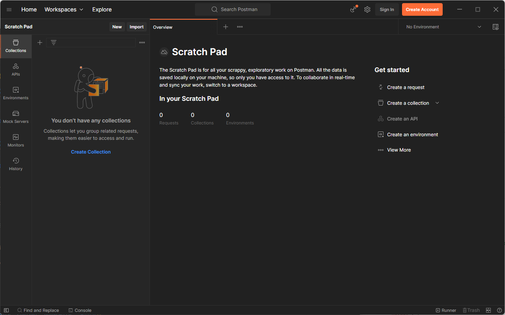
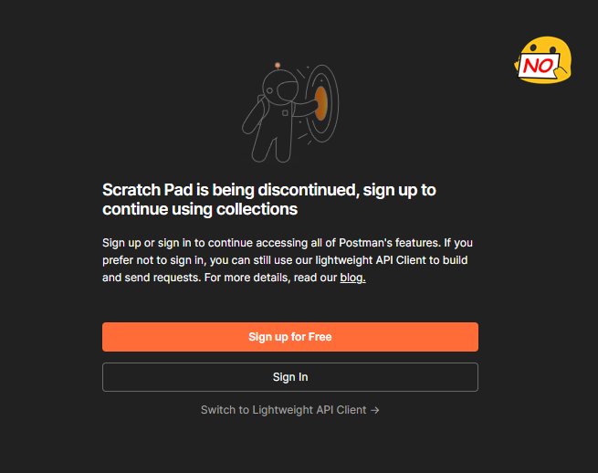
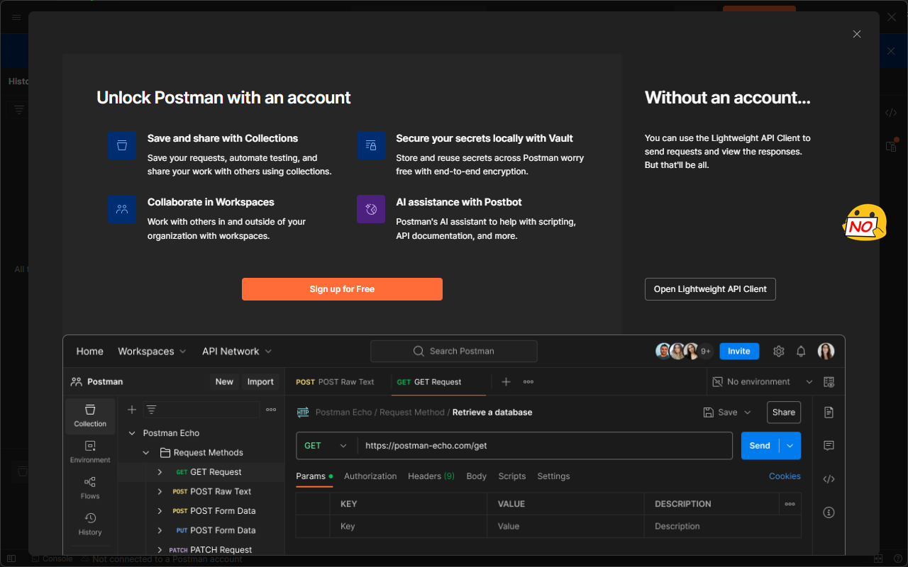
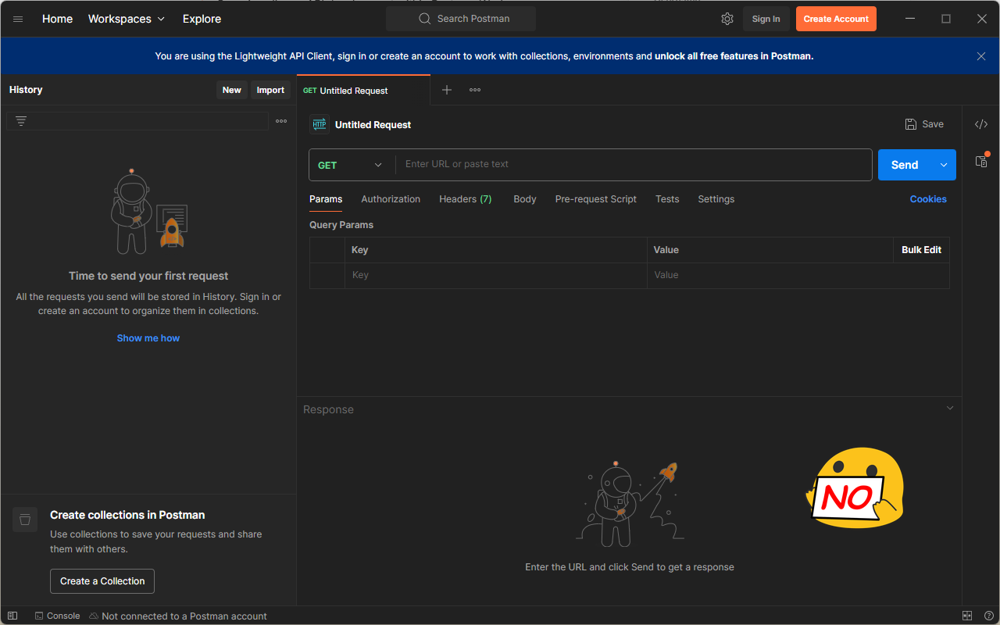

# Postman Scratch Patcher

This node script changes behavior of a Postman application to be used locally (without online services) in a following way:
- sets environment to work on scratchpad with collections (even when Postman is in the "Lighweight API Client mode")
- disables "ScratchPad is obsolete" pop-ups
- disables yellow top bar informing that you are "Working locally in Scratch pad. Switch to WORKSPLACE"

*REMARK: Your local Scratch Pad collections **will be removed** after executing this script (at least for now)*

## Requirements
- *Windows* (at this moment you can't patch Postman for Linux)
- node (command available in the PATH)
- asar (command available in the PATH, you can install this npm package by: npm install -g asar)
- Postman installed and run at least once

## How-to
**Step 1.** Install the latest version of Postman (Windows 64-bit) from the official website (run Postman at least once before this script)

**Step 2.** Install dependencies: `npm install -g asar`

**Step 3.** Execute a script
- `node postman-scratchpatcher.js -h` shows help
- `node postman-scratchpatcher.js patch` patches a Postman to work in Scratch Pad offline mode
- `node postman-scratchpatcher.js patch --remove-lightweight` patches a Postman and removes a "Lightweight HTTP mode". *THIS REMOVES YOUR SAVED COLLECTIONS AND ENVIRONMENTS"

**_Now, you can run a Postman in the offline Scratch Pad mode._**

You have to use Postman-Scratch-Patcher after an update. You can REALLY disable updates by removing a file `%localappdata%\Postman\Update.exe`

### After executing you *will see* the following:

### After executing you *will not see* the following:

## Use responsibly

_This software is exclusively designed for educational purposes._

_The developer are not liable for any damages or misuse that may result from using this tool._

_You have to accept this term to use or distribute this software._
